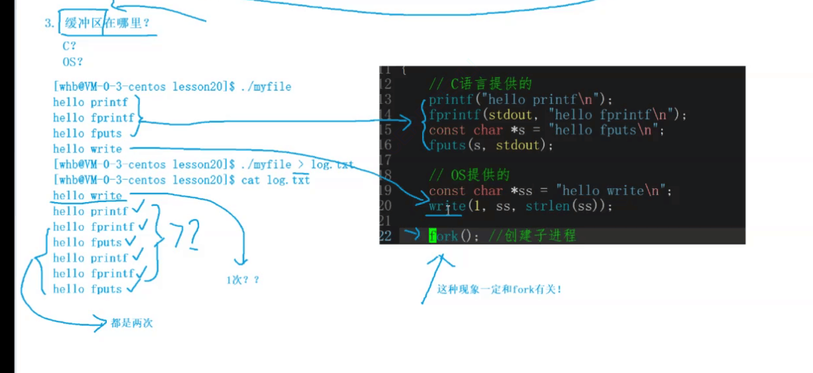

# 体系

冯诺依曼体系结构: <br>
1. 输入设备    
2. 输出设备
3. 运算器
4. 存储器 --> 内存
5. 控制器 central processing unit

<br>

# 进程Process

### 概念
> 由一个PCB结构体来 描述 <br>
```cpp
struct PCB{
    struct PCB *next;
}
```

> 进程 = 对应的代码和数据 + 程序对应的PCB结构体 <br>
> 进程信息通过 /proc/ 文件夹查看 <br>
> ps 查看进程 <br>
> ps axj 查看所有进程 <br>
> kill -9 + pid 杀掉进程 <br>

**4 大性质**
1. 竞争性 ： 优先级(高效合理的利用有限的资源)
2. 独立性 ： 进程独享资源
3. 并行 ：多个进程在多个 cpu 下同时运行
4. 并发 ：多个进程在一个 cpu 下采取进程切换的 方式运行


*** 

cpu 与操作系统 运行某一个进程，本质是从task_struct 结构体队列中 选择 一个 task_struct 来执行它的 代码 <br>

### 系统调用函数
1. pid_t fork() 创建子进程
> 返回值：对父进程返回pid，对子进程返回 0，创建失败返回 -1 <br> 
> 父子进程代码共享 变量再独自开辟空间存储 <br>


### 进程状态
> 新建 <br>
> 运行 (进程在运行队列中等待 并非一定在被cpu处理) <br>
> 阻塞: 进程运行需要的资源(磁盘，网卡...) 没有获得, 正在等待非cup资源就绪 <br>
> 挂起: 将长时间不执行的 进程代码和数据换出到磁盘 <br>

### Linux 内的进程状态

> 使用 kill 命名来 改变进程的 状态

```cpp

R, (running)
S, (sleeping) 可中断sleep
D, (disk sleep) 不可中断sleep (cup 也 不能 清理)
T, (stopped) 暂停/调试 状态
t, (tracing stop)
X, (dead) 终止(瞬时状态)
Z, (zombie) 僵尸状态 {
    
    是什么： 进程 终止 但未回收(子进程运行结束 父进程任在运行 未回收)

    为什么: 为了让Os 或 父进程来 回收

}

```
> 进程状态 后加上 "+" 号 说明这个进程属于前台进程(占用控制台命令行) <br>
> 父进程退出子进程还在运行(孤儿进程) 则会被 1 号进程领养


### 优先级

为什么：cpu 资源有限, 进程太多 <br>
什么是: 确定获得资源的 先后顺序 <br>
优先级 = 老优先级值(const) + nice值 <br>


# 环境变量

**在linux里**
1. 导入环境变量
export environment variable name = '' <br>

2. 显示环境变量
env <br>

3. 显示变量
set <br>


**在编程语言里** 
```cpp

// 由 父进程 导入
//           命令行参数              环境变量参数
int main(int argc, char *argv[], char *env[]) {

// 获取环境变量
    // extern char **environ;
    // getenv("environment variable name")
// 设置环境变量
    // putenv("") 把环境变量 添加到当前进程
    // setenv(" ", " ")
}

```

**命令行参数** <br>
argc: 传入参数个数 <br>
argv: 传入参数 <br>

作用:
    可以使同一个函数通过不同的参数执行不同的功能 <br>

***

# 进程地址空间

```cpp

#include <iostream>
#include <unistd.h>
#include <stdlib.h>
using namespace std;

int g_val = 100;

int main(int argc, char *argv[], char *evn[]) {

    pid_t id = fork();
    if (id == 0) {
        while (1) {
            printf("I am child, pid: %d, ppid: %d, g_val: %d, &g_val: %p\n", getpid(), getppid(), g_val, &g_val);
            sleep(1);
            g_val = 1;
        }
    }
    else if (id != -1) {
        
        while (1) {
            printf("I am father, pid: %d, ppid: %d, g_val: %d, &g_val: %p\n", getpid(), getppid(), g_val, &g_val);
            sleep(1);
        }
    }
    


    return 0;
}

```

运行上述代码会发现 g_val的地址 是 一样的
子进程改变了 g_val的 值 但是 父进程 的 g_val 没有变化
可以得出 这时的 地址 不是计算机内 的 物理地址 而是虚拟地址 <br>
子进程继承了 父进程的 地址空间映射的值, 但是映射的 物理空间不同 <br> 


```cpp
#include <iostream>
#include <unistd.h>
#include <stdlib.h>
using namespace std;

int un_g_val;
int g_val = 100;

int main(int argc, char *argv[], char *evn[]) {


    printf("%p\n", argv); // 命令行参数区
    printf("code: %p\n", main); // 代码段区

    printf("uninit: %p\n", &un_g_val); // 未初始化变量区
    
    printf("init: %p\n", &g_val); // 初始化变量区

    char *p = (char*) malloc(10);

    printf("heap: %p\n", p); // 堆区

    int a;
    printf("stack: %p\n", &a); // 栈区


    return 0;
}

```

虚拟内存 从上到下依次为: <br>

***

内核区 <br>

命令行参数 环境变量区 <br>

栈区 (从上往下增长 / 其他的都是从下往上增长) <br>

共享区<br>

堆区 <br>

未初始化变量区 <br>

初始化变量区 <br>

代码区 <br>

### what why 
1. 什么是 <br>

    > 操作系统  使用 虚拟地址映射物理地址的方式(***页表结构***)来为 进程分配 进程地址空间 <br>
    > 为一种数据结构 <br>
    > 保证每一个进程对应的页表映射的是不同的物理地址空间，做到进程之间的相互独立 <br>
    **地址空间是一种内核数据结构** <br>
2. 为什么有 <br>
    > **安全**：避免 进程 直接访问到 物理地址 造成的 未知错误，保护了物理内存<br>
    > **管理**：通过页表可以任意分配物理内存 <br>
    > **高效**：对于申请 物理空间 **操作系统不会马上为你分配(但是编译器会为你申请出一块虚拟内存)** 而是当你对这块物理地址进行访问时才会开始进行页表映射，申请分配内存等相应的算法 `延迟分配`<br>
    
3. 功能 <br>
    * 可以实现 进程的 **代码 和 数据** 分离加载，即实现对程序的分批加载，分批换出， 从而实现以小内存的代价加载大内存的程序 <br>


# 进程的创建

### 函数 fork()
1. 对父进程返回子进程id， 失败返回-1。 对子进程返回0 <br>
   * 失败原因: <br>
         * 系统中进程过多 <br>
         * 进程数超出了用户进程限制 <br>


<br><br><br>

# 进程的终止

<br><br>

1. 终止时操作系统的工作: <br>
    1. 释放进程申请的系统资源 <br>


2. 终止常见状态 <br>
    1. 进程正常运行结束 目的达到 <br>
    2. 进程正常运行结束 目的未达到 <br>
    3. 进程异常运行结束 <br>
    > 查看退出状态： echo $? `可查看上一个执行完的进程的退出状态` <br>

    <br>

    **退出码**
    用来标识 进程结束的原因，提供给父进程 <br>
    

3. 终止进程
    > **main 函数内** return + 进程退出码 <br>
    > **任意函数内**exit(进程退出码) 语言包装函数 <br>
    >_exit() 系统借口 <br>


4. 进程等待
    > 父进程通过进程等待 来 获取子进程的退出信息 <br>

### wait / waitpid
**wait / waitpid 函数**
>  wait for process to change state, 等待 子进程 运行状态的变化 <br>
> 等待完毕返回 子进程pid，失败返回 0 <br>
> 本质为 读取 子进程 的 task_struct 信息 <br>
```c 

//// 
wait(int *status);
pid_t wait_id = wait(NULL); // 父进程 等待子进程结束。
if (wait_id == id) {
            printf("the child process has been done!\n");
}


////
                    存储子进程的退出结果
pid_t waitpid(pit_t pid, int *status, int options);
>0 等待结束         等待进程pid/-1为等待任意进程
0 等待成功但子进程并未退出                等待时进程所处的状态 默认为0 为阻塞等待
<0等待失败                               WNOHANG 非阻塞等待

int status = 0;
pid_t wait_id = waitpid(id, &status, 0); // 
// waitpid 返回的 status 是 按照 二进制的 方式返回的 0 ~ 32 其中 15 ~ 8 为退出码状态 (仅为正常退出)
// 最低 7 位 表示 收到的 操作系统的 信号编号 0 为 正常 退出
if (wait_id == id) {
    printf("the child process has been done! exit status: %d\n", (status >> 8) & 0xff); // 0xff == 00....00000011111111
    printf("notify: %d\n", status & 0x7f);
}
```

<br>

阻塞等待 和 非阻塞等待 <br>
> **阻塞等待**：在 wait 函数 内直接 记录pc 指针的位置随后阻塞 <br>
> **非阻塞等待**：在wait 函数 内 直接return 可手动**编写代码**进行多次 间断的 查询子进程的 状态 <br> 


# 进程程序替换函数

> 原理:
    > 子进程调用 exec 函数，使改进程的用户空间**代码和数据**被新程序**完全替换** <br>

**int execl(const char *pathname, const char *arg, ..., NULL)** 
> pathname 可执行文件路径 <br> 
> *arg 命令行参数<br>
> ... 可变参数列表 <br>
> 最后一个参数必须是NULL 表示参数传递完毕 <br>

<br>

**int execv(const char* pathname, char *coant argv[])** 
> 文件路径 <br>
> argv 参数数组, 以NULL 结尾 <br>

<br>


**int execlp(const char *file, const char *arg, ..., NULL)** 
> 在环境变量PATH 中查找 file <br>

<br>

**int execvp(const char* pathname, char *coant argv[])** 
> 在环境变量PATH下 查找 file <br>
> argv 参数数组, 以NULL 结尾 <br>

**int execvpe(const char *file, char *const argv[], char *const envp[])** 
<br><br>

**int execle(const char *pathname, const char *arg, ... NULL, char *const envp[] */)**
> char *const envp[] 环境变量 数组 <br>

<br>

> 函数 命名理解
> * l(list): 参数用列表 <br>
> * v(vector): 参数用数组 <br>
> * p(path)： 自动搜索环境变量 PATH <br>
> * e(env): 维护自己的环境变量 <br>

<br>

**如何执行其它程序**
> 1. 生成可执行文件 <br>
> 2. 进行代码和数据替换 <br>

> 使用 exec 系列函数 执行不同的语言程序 <br>
```c
int main(int argc, char *argv[], char *evn[]) {

    char *const arg[] = {"-a", "-l", NULL};
    char *str[] = {
        "python", 
        "bash"
    };
    char *task[] = {
        "test.py",
        "test.sh"
    };
    for (int i = 0;i < 2;i ++ ) {
        pid_t id = fork();
        if (id == 0) {
            execlp(str[i], str[i], task[i], NULL);
        }
        else wait(NULL);
    }
    return 0;
}
```


# 基础IO

## 文件描述
文件 = 文件内容 + 文件属性 <br>
文件的 操作: <br>
> 1. 对内容 <br>
> * 语言接口 写入 <br>
>   w(write) <br>
>> ```cpp
>> const char *s1 = "hello fwrite";
>> const char *s1 = "hello fwrite\n";
>> fwrite(s1, strlen(s1), 1, fp);
>> const char *s2 = "hello fprintf\n";
>> fprintf(fp, "%s", s2);
>> const char *s3 = "hello fputs\n";
>> fputs(s3, fp);
>>
>> ```
> a(append) <br>
> r (read) <br>
>> fgets(buffer, len, FILE*) <br>
> 2. 对属性 <br>


### 系统文件操作接口
1. open <br>


**int open(const char *pathname, int flags)** <br> 
> flags(比特表示 状态): <br>
> * O_RDONLY：只读 <br> 
> * O_WRONLY：只写 <br>
> * O_RDWR：读写 <br>
> * O_CREAT: 没有目标文件 则创建 <br>
> * O_TRUNC: 清空文件 <br>
> * O_APPEND: 在文件尾追加 <br>


**int open(const char *pathname, int flags, mode_t mode)** <br>
> mode(权限, 8 进制表示)： <br>
> 通常用于 文件不存在 创建文件 <br>


2. close
**int close(int fp)** <br>

3. write
**ssize_t write(int fd, const void *buf, size_t count)** <br>

4. read
**ssize_t read(int fd, void *buf, size_t count)**: 按字节读取, sszie_t 为 实际读取到的数字个数 <br>


### 文件描述符
1. 0, 1, 2 <br>
分别为 stdin stdout stderr 文件 <br>
后续文件 数字依次增加, 本质为数组下标 <br>
当数组 前面 有 某个下标对应的 文件被 关闭时 会采用就小原则来分配下标 <br>

2. 重定向 <br>
更改 fd 内容的 指向 <br >
> 1. 利用 fd 分配机制 <br>
> 2. 利用系统调用函数 <br>
> **int dup2(int oldfd, int newfd)** <br>
>  把 oldfd 的 内容 拷贝到 newfd 里 <br>


# 缓冲区 cache
提高系统效率 <br>

 <br>
```cpp
    
char *a = "hello printf";
char *b = "hello fprintf";
char *c = "hello fputs\n";
char *d = "hello write\n";

fprintf(stdout, "%s\n", b);
printf("%s\n", a);
fputs(c, stdout);
write(1, d, strlen(d));

// fflush(stdout);
fork();

```
同样的 文件 向显示器 打印 与 向文件打印的 结果不一样 <br>
系统接口只打印一次， 语言接口打印 2 次 <br>
原因:<br> 
1. 当对 文件的输出进行重定向时， 隐性的改变了 缓冲区的 刷新机制 *显示器* > *磁盘* (*行缓冲* > *全缓冲*) fork()时 函数执行完 但数据没有刷新 子进程会拷贝父进程的缓冲区<br>
2. 把数据刷新 **(清空缓冲区)** 到输出的目标文件中也是发生了写时拷贝 <br>


**int syncfs(int fd)**  <br>
把数据写入到磁盘 <br>


