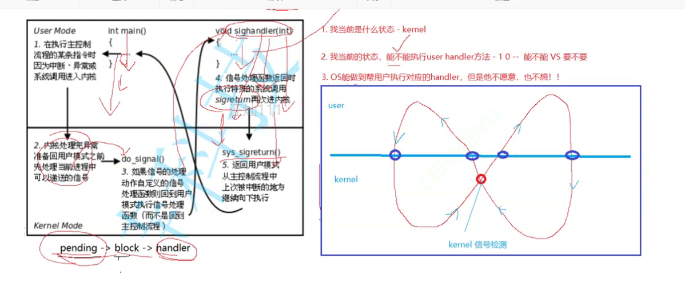

# 体系

冯诺依曼体系结构: <br>
1. 输入设备    
2. 输出设备
3. 运算器
4. 存储器 --> 内存
5. 控制器 central processing unit

<br>

# 进程Process

### 概念
> 由一个PCB结构体来 描述 <br>
```cpp
struct PCB{
    struct PCB *next;
}
```

> 进程 = 对应的代码和数据 + 程序对应的PCB结构体 <br>
> 进程信息通过 /proc/ 文件夹查看 <br>
> ps 查看进程 <br>
> ps axj 查看所有进程 <br>
> kill -9 + pid 杀掉进程 <br>

**4 大性质**
1. 竞争性 ： 优先级(高效合理的利用有限的资源)
2. 独立性 ： 进程独享资源
3. 并行 ：多个进程在多个 cpu 下同时运行
4. 并发 ：多个进程在一个 cpu 下采取进程切换的 方式运行


*** 

cpu 与操作系统 运行某一个进程，本质是从task_struct 结构体队列中 选择 一个 task_struct 来执行它的 代码 <br>

### 系统调用函数
1. pid_t fork() 创建子进程
> 返回值：对父进程返回pid，对子进程返回 0，创建失败返回 -1 <br> 
> 父子进程代码共享 变量再独自开辟空间存储 <br>


### 进程状态
> 新建 <br>
> 运行 (进程在运行队列中等待 并非一定在被cpu处理) <br>
> 阻塞: 进程运行需要的资源(磁盘，网卡...) 没有获得, 正在等待非cup资源就绪 <br>
> 挂起: 将长时间不执行的 进程代码和数据换出到磁盘 <br>

### Linux 内的进程状态

> 使用 kill 命名来 改变进程的 状态

```cpp

R, (running)
S, (sleeping) 可中断sleep
D, (disk sleep) 不可中断sleep (cup 也 不能 清理)
T, (stopped) 暂停/调试 状态
t, (tracing stop)
X, (dead) 终止(瞬时状态)
Z, (zombie) 僵尸状态 {
    
    是什么： 进程 终止 但未回收(子进程运行结束 父进程任在运行 未回收)

    为什么: 为了让Os 或 父进程来 回收

}

```
> 进程状态 后加上 "+" 号 说明这个进程属于前台进程(占用控制台命令行) <br>
> 父进程退出子进程还在运行(孤儿进程) 则会被 1 号进程领养


### 优先级

为什么：cpu 资源有限, 进程太多 <br>
什么是: 确定获得资源的 先后顺序 <br>
优先级 = 老优先级值(const) + nice值 <br>


# 环境变量

**在linux里**
1. 导入环境变量
export environment variable name = '' <br>

2. 显示环境变量
env <br>

3. 显示变量
set <br>


**在编程语言里** 
```cpp

// 由 父进程 导入
//           命令行参数              环境变量参数
int main(int argc, char *argv[], char *env[]) {

// 获取环境变量
    // extern char **environ;
    // getenv("environment variable name")
// 设置环境变量
    // putenv("") 把环境变量 添加到当前进程
    // setenv(" ", " ")
}

```

**命令行参数** <br>
argc: 传入参数个数 <br>
argv: 传入参数 <br>

作用:
    可以使同一个函数通过不同的参数执行不同的功能 <br>

***

# 进程地址空间

```cpp

#include <iostream>
#include <unistd.h>
#include <stdlib.h>
using namespace std;

int g_val = 100;

int main(int argc, char *argv[], char *evn[]) {

    pid_t id = fork();
    if (id == 0) {
        while (1) {
            printf("I am child, pid: %d, ppid: %d, g_val: %d, &g_val: %p\n", getpid(), getppid(), g_val, &g_val);
            sleep(1);
            g_val = 1;
        }
    }
    else if (id != -1) {
        
        while (1) {
            printf("I am father, pid: %d, ppid: %d, g_val: %d, &g_val: %p\n", getpid(), getppid(), g_val, &g_val);
            sleep(1);
        }
    }
    


    return 0;
}

```

运行上述代码会发现 g_val的地址 是 一样的
子进程改变了 g_val的 值 但是 父进程 的 g_val 没有变化
可以得出 这时的 地址 不是计算机内 的 物理地址 而是虚拟地址 <br>
子进程继承了 父进程的 地址空间映射的值, 但是映射的 物理空间不同 <br> 


```cpp
#include <iostream>
#include <unistd.h>
#include <stdlib.h>
using namespace std;

int un_g_val;
int g_val = 100;

int main(int argc, char *argv[], char *evn[]) {


    printf("%p\n", argv); // 命令行参数区
    printf("code: %p\n", main); // 代码段区

    printf("uninit: %p\n", &un_g_val); // 未初始化变量区
    
    printf("init: %p\n", &g_val); // 初始化变量区

    char *p = (char*) malloc(10);

    printf("heap: %p\n", p); // 堆区

    int a;
    printf("stack: %p\n", &a); // 栈区


    return 0;
}

```

虚拟内存 从上到下依次为: <br>

***

内核区 <br>

命令行参数 环境变量区 <br>

栈区 (从上往下增长 / 其他的都是从下往上增长) <br>

共享区<br>

堆区 <br>

未初始化变量区 <br>

初始化变量区 <br>

代码区 <br>

### what why 
1. 什么是 <br>

    > 操作系统  使用 虚拟地址映射物理地址的方式(***页表结构***)来为 进程分配 进程地址空间 <br>
    > 为一种数据结构 <br>
    > 保证每一个进程对应的页表映射的是不同的物理地址空间，做到进程之间的相互独立 <br>
    **地址空间是一种内核数据结构** <br>
2. 为什么有 <br>
    > **安全**：避免 进程 直接访问到 物理地址 造成的 未知错误，保护了物理内存<br>
    > **管理**：通过页表可以任意分配物理内存 <br>
    > **高效**：对于申请 物理空间 **操作系统不会马上为你分配(但是编译器会为你申请出一块虚拟内存)** 而是当你对这块物理地址进行访问时才会开始进行页表映射，申请分配内存等相应的算法 `延迟分配`<br>
    
3. 功能 <br>
    * 可以实现 进程的 **代码 和 数据** 分离加载，即实现对程序的分批加载，分批换出， 从而实现以小内存的代价加载大内存的程序 <br>


# 进程的创建

### 函数 fork()
1. 对父进程返回子进程id， 失败返回-1。 对子进程返回0 <br>
   * 失败原因: <br>
         * 系统中进程过多 <br>
         * 进程数超出了用户进程限制 <br>


<br><br><br>

# 进程的终止

<br><br>

1. 终止时操作系统的工作: <br>
    1. 释放进程申请的系统资源 <br>


2. 终止常见状态 <br>
    1. 进程正常运行结束 目的达到 <br>
    2. 进程正常运行结束 目的未达到 <br>
    3. 进程异常运行结束 <br>
    > 查看退出状态： echo $? `可查看上一个执行完的进程的退出状态` <br>

    <br>

    **退出码**
查看所有退出码 对应的 错误信息: <br>
```cpp
for (int i = 0;i < 200;i ++ ) {
    printf("%s \n", strerror(i));
}
```
    用来标识 进程结束的原因，提供给父进程 <br>
    

3. 终止进程
    > **main 函数内** return + 进程退出码 <br>
    > **任意函数内**exit(进程退出码) 语言包装函数 <br>
    >_exit() 系统借口 <br>


4. 进程等待
    > 父进程通过进程等待 来 获取子进程的退出信息 <br>

### wait / waitpid
**wait / waitpid 函数**
>  wait for process to change state, 等待 子进程 运行状态的变化 <br>
> 等待完毕返回 子进程pid，失败返回 0 <br>
> 本质为 读取 子进程 的 task_struct 信息 <br>
```c 

//// 
wait(int *status);
pid_t wait_id = wait(NULL); // 父进程 等待子进程结束。
if (wait_id == id) {
            printf("the child process has been done!\n");
}


////
                    存储子进程的退出结果
pid_t waitpid(pit_t pid, int *status, int options);
>0 等待结束         等待进程pid/-1为等待任意进程
0 等待成功但子进程并未退出                等待时进程所处的状态 默认为0 为阻塞等待
<0等待失败                               WNOHANG 非阻塞等待

int status = 0;
pid_t wait_id = waitpid(id, &status, 0); // 
// waitpid 返回的 status 是 按照 二进制的 方式返回的 0 ~ 32 其中 15 ~ 8 为退出码状态 (仅为正常退出)
// 最低 7 位 表示 收到的 操作系统的 信号编号 0 为 正常 退出
if (wait_id == id) {
    printf("the child process has been done! exit status: %d\n", (status >> 8) & 0xff); // 0xff == 00....00000011111111
    printf("notify: %d\n", status & 0x7f);
}
```

<br>

阻塞等待 和 非阻塞等待 <br>
> **阻塞等待**：在 wait 函数 内直接 记录pc 指针的位置随后阻塞 <br>
> **非阻塞等待**：在wait 函数 内 直接return 可手动**编写代码**进行多次 间断的 查询子进程的 状态 <br> 


# 进程程序替换函数

> 原理:
    > 子进程调用 exec 函数，使改进程的用户空间**代码和数据**被新程序**完全替换** <br>

**int execl(const char *pathname, const char *arg, ..., NULL)** 
> pathname 可执行文件路径 <br> 
> *arg 命令行参数<br>
> ... 可变参数列表 <br>
> 最后一个参数必须是NULL 表示参数传递完毕 <br>

<br>

**int execv(const char* pathname, char *coant argv[])** 
> 文件路径 <br>
> argv 参数数组, 以NULL 结尾 <br>

<br>


**int execlp(const char *file, const char *arg, ..., NULL)** 
> 在环境变量PATH 中查找 file <br>

<br>

**int execvp(const char* pathname, char *coant argv[])** 
> 在环境变量PATH下 查找 file <br>
> argv 参数数组, 以NULL 结尾 <br>

**int execvpe(const char *file, char *const argv[], char *const envp[])** 
<br><br>

**int execle(const char *pathname, const char *arg, ... NULL, char *const envp[] */)**
> char *const envp[] 环境变量 数组 <br>

<br>

> 函数 命名理解
> * l(list): 参数用列表 <br>
> * v(vector): 参数用数组 <br>
> * p(path)： 自动搜索环境变量 PATH <br>
> * e(env): 维护自己的环境变量 <br>

<br>

**如何执行其它程序**
> 1. 生成可执行文件 <br>
> 2. 进行代码和数据替换 <br>

> 使用 exec 系列函数 执行不同的语言程序 <br>
```c
int main(int argc, char *argv[], char *evn[]) {

    char *const arg[] = {"-a", "-l", NULL};
    char *str[] = {
        "python", 
        "bash"
    };
    char *task[] = {
        "test.py",
        "test.sh"
    };
    for (int i = 0;i < 2;i ++ ) {
        pid_t id = fork();
        if (id == 0) {
            execlp(str[i], str[i], task[i], NULL);
        }
        else wait(NULL);
    }
    return 0;
}
```


# 基础IO

## 文件描述
文件 = 文件内容 + 文件属性 <br>
文件的 操作: <br>
> 1. 对内容 <br>
> * 语言接口 写入 <br>
>   w(write) <br>
>> ```cpp
>> const char *s1 = "hello fwrite";
>> const char *s1 = "hello fwrite\n";
>> fwrite(s1, strlen(s1), 1, fp);
>> const char *s2 = "hello fprintf\n";
>> fprintf(fp, "%s", s2);
>> const char *s3 = "hello fputs\n";
>> fputs(s3, fp);
>>
>> ```
> a(append) <br>
> r (read) <br>
>> fgets(buffer, len, FILE*) <br>
> 2. 对属性 <br>


### 系统文件操作接口
1. open <br>


**int open(const char *pathname, int flags)** <br> 
> flags(比特表示 状态): <br>
> * O_RDONLY：只读 <br> 
> * O_WRONLY：只写 <br>
> * O_RDWR：读写 <br>
> * O_CREAT: 没有目标文件 则创建 <br>
> * O_TRUNC: 清空文件 <br>
> * O_APPEND: 在文件尾追加 <br>


**int open(const char *pathname, int flags, mode_t mode)** <br>
> mode(权限, 8 进制表示)： <br>
> 通常用于 文件不存在 创建文件 <br>


2. close
**int close(int fp)** <br>

3. write
**ssize_t write(int fd, const void *buf, size_t count)** <br>

4. read
**ssize_t read(int fd, void *buf, size_t count)**: 按字节读取, sszie_t 为 实际读取到的数字个数 <br>


### 文件描述符
1. 0, 1, 2 <br>
分别为 stdin stdout stderr 文件 <br>
后续文件 数字依次增加, 本质为数组下标 <br>
当数组 前面 有 某个下标对应的 文件被 关闭时 会采用就小原则来分配下标 <br>

2. 重定向 <br>
更改 fd 内容的 指向 <br >
> 1. 利用 fd 分配机制 <br>
> 2. 利用系统调用函数 <br>
> **int dup2(int oldfd, int newfd)** <br>
>  把 oldfd 的 内容 拷贝到 newfd 里 <br>


### stdout 和 stderr 的区别
```cpp
printf("hello printf \n");
fprintf(stdout, "hello fprintf \n");
perror("hello perror ");

const char *s1 = "hello write \n";
write(1, s1, strlen(s1));

std::cout << "hello cout \n";
std::cerr << "hello cerr \n";
```

> 文件描述符> 文件  指定文件的输出 输出到指定文件 <br>
1. 在输出重定向时 只会重定向 stdout， 因为 stdout 与 stderr 的 文件描述符是 不同的 (但 2 个文件指向的 都为显示器) <br> 


## 缓冲区 cache
提高系统效率 <br>

 <br>
```cpp
    
char *a = "hello printf";
char *b = "hello fprintf";
char *c = "hello fputs\n";
char *d = "hello write\n";

fprintf(stdout, "%s\n", b);
printf("%s\n", a);
fputs(c, stdout);
write(1, d, strlen(d));

// fflush(stdout);
fork();

```
同样的 文件 向显示器 打印 与 向文件打印的 结果不一样 <br>
系统接口只打印一次， 语言接口打印 2 次 <br>
原因:<br> 
1. 当对 文件的输出进行重定向时， 隐性的改变了 缓冲区的 刷新机制 *显示器* > *磁盘* (*行缓冲* > *全缓冲*) fork()时 函数执行完 但数据没有刷新 子进程会拷贝父进程的缓冲区<br>
2. 把数据刷新 **(清空缓冲区)** 到输出的目标文件中也是发生了写时拷贝 <br>


**int syncfs(int fd)**  <br>
把数据写入到磁盘 <br>


## 文件系统
系统内的 文件区块分区 <br>
 <br>

1. 磁盘级文件(未被打开的文件) <br>
   > 使用 Inode编号 来标识每一个文件的 **Inode空间** <br>


# 软硬链接

1. 软链接: ln -s \[main_file\] \[link_file\] <br>
> 形成一个link_file 软链接到 main_file <br>
```cpp
678131 lrwxrwxrwx 1 wc wc      9 May 17 14:14 sortlink -> link1.txt
669800 -rw-rw-r-- 1 wc wc     12 May 17 14:18 link1.txt
```
> 应用: 快捷方式 <br>
> 软链接的 文件内容是指向文件的对应 路径 <br>

<br>

2. 硬链接 ln  \[main_file\] \[link_file\] <br>
> 形成一个link_file 硬链接到 main_file <br>
```cpp
669836 -rw-rw-r-- 2 wc wc     12 May 17 14:17 hardlink
669836 -rw-rw-r-- 2 wc wc     12 May 17 14:17 link2.txt
```
> 


<br>

**区别**: 是否有独立的 inode <br>

<br>

3. 删除链接: unlink <br>


# 动静态库

* 生成 链接文件： g++ -c library.cc -o library.o <br>

1. .a(静态库)
> 生成静态库 文件: `ar -rc lib_user_defined_name.a ....链接文件....` <br>
> -rc: replace and create

拷贝 对应的 文件到 对应的 程序运行搜索目录下: <br>
/lib and /include <br>
 
3. .so(动态库)
> `gcc -shared .o文件.. -o lib_name_.so` <br> 
> gcc 编译的 .o 文件需在 编译时 加上 -fPIC 选项 <br>
> 动态库可以和 可执行程序分批加载 是在程序运行期间链接<br>
> 


# 进程间通信(IPC)

> 因为进程的特征(独立性) 进程间想进行通信 的难度很大 <br>


<br> <br>

### 介绍
**进程通信的 目的**: <br>
> * 数据共享 <br>
> * 资源共享 <br>
> * 通知事件 <br>
> * 进程控制 <br>

<br> <br>

1. 必要性 <br>
>  单进程 无法使用并发能力， 更加无法实现多**进程协同**。 <br>

2. 本质理解 <br>
>  让不同的 进程看到同一份 内存 <br>

3. 进程通信的 一些标准
   > * Linux 原生资源: 管道 <br>
   > * SystemV：多线程单机通信 <br>
   > * posix： 多线程网络通信 <br>
<br> <br>


### 管道

1. 管道 是 用来 具有 父子类似关系的 进程 进行通信(需获取发送端的 资源信息) <br>
2. 通信速度 与 发送信息的进程的 发送速度有关 <br>
3. 管道提供的是 面向流式的通信服务(字节流) <br> 
4. 管道是 基于文件的， 文件的 生命周期是 随进程的 <br>
<br>


* 匿名管道：<br>
> **int pipe(int pipefd[2])** <br>
> 函数 会修改pipefd 数组 并且返回 2 个 文件 描述符 fd 来表示创建的 管道 的 入口和出口<br>
> pipefd[0]: 读端， pipefd[1]: 写端 <br>

*** 

* **Demo1**
```cpp

int main() {


    int pipeid[2] = {0}; // 创建管道
    int res_p = pipe(pipeid); // pipeid[0] 表示读出端 pipeid[1] 表示写入端
    // 1 -----> 0
    if (res_p == -1) {
        perror("pipe");
        exit(1);
    }

    pid_t id = fork();
    if (id == -1) {
        perror("fork");
        exit(1);
    }    

    if (id == 0) {
        // 子进程 读取
        // 进程 关闭 自己不需要的 端
        close(pipeid[1]);
        while (1) {
            char buffer[1024];
            // 读取 管道内的 信息
            // 从进程 自己 对应的 端进行操作
            int size = read(pipeid[0], buffer, 1024 - 1);
            if (size > 0) {
                buffer[size] = 0;
                printf("%d %s\n", size, buffer);
                std::cout << "father's message: " << buffer << '\n';
            }

            sleep(1);
        }   
        close(pipeid[0]);
    }
    else {
        // 父进程
        // 进程 关闭 自己不需要的 端
        close(pipeid[0]);
        std::string str = "hello child process!";

        int cnt = 0;
        while (1) {
            char buffer[1024];
            snprintf(buffer, sizeof(buffer), "%s[%d] NO.%d", str.c_str(), getpid(), ++ cnt);         
            // 从进程 自己 对应的 端进行操作
            // printf("father %s\n", buffer);
            write(pipeid[1], buffer, strlen(buffer));
            sleep(1);
        }
        
        close(pipeid[1]);
        int wait = waitpid(id, nullptr, 0);
    }

    return 0;
}
```

<br> <br>


* 命名管道 <br>

> 在 命令行上创建， 可用于 没有父子类关系的 进程进行通信 <br>
> `mkfifo  [option] [name]` <br>
> 系统调用接口 `int mkfifo(const char* pathbname, mode_t mode)`: mode 表示 为 文件权限 <br>
> `unlink(pipe_path)` 删除管道 <br>


### 消息队列


### 共享内存 System V 通信
1. 原理 
> 操作系统 在 物理内存 内 吧 一块 内存 通过页表映射 得到 对应的 虚拟地址， 把 这块物理地址 同样的 映射到不同的 进程， 使这些进程能够通过 **虚拟内存 --> 页表 --> 物理内存** 访问 到同一块内存， 从而实现进程间通信 <br>

2. 共享内存的建立
> 隶属于 操作系统 <br>
> 共享内存 = 共享内存块 + 共享内存的 内核数据结构 (先描述，再组织)<br>

* 接口 
```cpp
int shmget(key_t key, size_t size, int shmflg); 返回值 为 共享内存的 标识符    

key: 用于给 通信对方 来申请的共享内存 为同一块内存 


size: 共享内存大小


shmflg 表示：
IPC_CREAT: 创建一个共享内存， 如果已经存在则返回 存在的 共享内存
IPC_EXCL: 与IPC_CREAT 一起使用，  创建一个共享内存， 如果已经存在则出错返回


```

> System V IPC 资源 生命周期 随内核 <br>
> 1. 手动删除 ipcrm -m shmid <br>
> 2. 代码删除 `int shmctl(int __shmid, int __cmd(指令), shmid_ds *__buf(操作系统描述共享内存的结构体))` <br>
> **IPC 资源必须删除，不会自动清除，除非重启 因为IPC 资源 生命周期 随内核**  <br>

> 挂接 共享内存 `void shmat(int shmid, const void *shmaddr, int shmflg)` <br> 
> 从地址空间 内 去 关联 `void shmdt(const void *shmaddr)` <br>
> attach：连接共享内存  <br>
> detach: 断开连接 <br>


**共享内存的特性**
1. 共享内存是 进程通信中最快速的(不需要经过系统) <br>
2. 共享内存缺乏 访问控制 <br>


### System V信号量
> 对 临界资源(多个进程能访问的资源)的 管理, 本质为 一个计数器 <br>
>  P 申请信号量 V 释放信号量 <br>

**进程互斥**
* 由于各进程要求共享资源，而且有些资源需要互斥使用，因此各进程间竞争使用这些资源，进程的这种
关系为进程的互斥 <br>
* 系统中某些资源一次只允许一个进程使用，称这样的资源为临界资源或互斥资源。<br>
* 在进程中涉及到互斥资源的程序段叫临界区 <br>


*** 

<br>

# 信号
***

<br>

### what why how


### core dump 核心转储
> 当进程 出现 某种异常 是否 由 操作系统将 进程在内存中的 核心数保持到磁盘中 <br>


1. 什么是信号 <br>
> * 本质是一种**通知机制**. 用户or操作系统 通过发送一定的信号 来**通知进程 后续处理**来达到 某种目的 <br>
> * 进程 必须 识别信号 处理信号 存储信号 的能力 <br> 
> * 一般而言信号的产生相对进程来说是 **异步**的 <br>
> * **信号处理**: <br>
> * 1. 默认处理 (进程自带) `signal(signum, SIG_DFL)`使用 语言提供的 宏来达到 默认处理信号<br>
> * 2. 忽略 `signal(signum, SIG_IGN)` 使用 语言提供的 宏来达到 忽略信号<br>
> * 3. 自定义处理 (捕捉信号) <br>
> * **常见信号**: <br>
> * 1. kill -l 显示linux 内 内置的信号 <br>
> * **信号发送的本质是 操作系统 把 信号信息写进进程的PCB 结构体内(信号位图) <br>

2. 如何使用
`signal 函数` **修改**进程对后续进程的处理动作 <br>
> sighandler_t signal(int signum, sighandler_t handler) <br>
> signum: 信号编号数值. handler: 自定义处理方法 `void handler(signum)` <br>
`sigaction 函数` 
```cpp
int sigaction(int signum, const struct sigaction *act, struct sigaction *oldact) 

struct sigaction {
    void (*handler)(int); // 自定义函数
    sigset_t sa_mask; // 处理信号过程中 Os 收到相同的 信号是 会 自动 阻塞这些信号。 sa_mask 用来想除了阻塞当前信号外 还想阻塞其他 信号 来用sa_mask 来说明
                      // 当信号处理完毕 后Os 会自动将 信号屏蔽字恢复 到原来的 状态
}

signum：要被捕捉的 信号
act: 对信号进行的 新的处理动作
oldact: 旧的处理动作


usage:
struct sigaction act, oldact;
act.sa_flags = 0;
sigemptyset(&act.sa_mask);
act.sa_handler = handler;

sigaction(2, &act, nullptr);
```


`int kill(pid_t pid, int sig)`通过系统调用接口 向进程发送信号 <br>
`int raise(int sig)` 给自己发送指定的 信号 <br>
`void abort()` 给自己 发送 6 号信号 <br>

### 软件条件产生信号 
1. 管道的 验证
 <br>
> 当异常产生时 操作系统会终止进程 并设置错误码为 SIGPIPE(13) <br>
**验证**:  <br>
```cpp

int main() {

    pid_t id = fork();
    int pipeid[2] = {0};
    pipe(pipeid);
    
    
    if (id == 0) {
        close(pipeid[0]);
        string str = "Writing!!!!!!!!!!";
        while (1) {
            write(pipeid[1], str.c_str(), (int)str.size());
        }
        close(pipeid[1]);
        exit(0);
    }
    else {

        close(pipeid[1]);
        char buffer[1024];
        for (int i = 1;i <= 5;i ++ ) {
            sleep(1);
            read(pipeid[0], buffer, 1024 - 1);
        }
        close(pipeid[0]);
        int status = 0;
        int wait_id = waitpid(id, &status, 0);
        printf("子进程的退出码为[%d]\n", status & 0x7f);
    }
    
    return 0;
}

```

2. `int alarm(int seconds)` 设置闹钟 参数为秒数 在特定的秒数结束后 终止进程 设置退出码为 SIGNALRM(14)<br>


### 硬件异常产生信号 
> 当发生硬件异常 信号，操作系统会不断的给进程传入 异常信号 直到(寄存在寄存器内的异常被解决) <br>

<br>


### 阻塞信号
1. 信号常见的 其他相关概念 <br>
> 实施执行 对应信号的 处理动作称为信号递达 <br>
> 信号在 传递到 递达之间的 状态 叫做 信号未决 <br>
> 操作系统 可以 选择阻塞 某个信号， 使信号一直处于 信号未决 状态 ， 直到操作系统解除对该信号的阻塞 <br>

<br>


### 对信号集 进行操作

> 信号被处理的历程: <br>
> 1. 查看block 表 信号是否被block <br>
> 2. 查看 pending 表 信号是否送达  <br>
> 3. 调用对应的 handler 方法 对信号进行处理 <br>


* 系统调用接口 <br>

对pending 进行操作 <br>
1. int sigpending(sigset_t *set) 获取 pending 位图 <br>
2. 对 set 对象指向的 位图 结构 进行操作 <br>
* int sigemptyset(sigset_t *set) 把对应的 位图 进行 清空 <br>
* int sigfillset(sigset_t *set) 把对应的 位图用 1 填满 <br>
* int sigaddset(sigset_t *set, int signum) 把位图 对应的信号位置 设置 为 1 <br>
* int sigdelset(sigset_t *set, int signum) 把位图 对应的信号位置 设置 为 0 <br>
* int sigismember(const sigset_t *set, int signum) 检查 位图 内是否 存在 该信号 <br>


对block 进行操作 <br>
int sigprocmask(int how, sigset_t* set, sigset_t* oldset) <br> 
The behavior of the call is dependent on the value of how, as follows ： <br>
1. SIG_BLOCK: 当前 的 block set | set <br>
2. SIG_UNBLOCK: 当前的 block set & ~set <br>
3. SIG_SETMASK: 用 set 覆盖当前的 block set <br>
If oldset is non-NULL, the previous value of the signal mask is stored in oldset. <br>


### 内核态 用户态 
信号 字段 是 存储 在 PCB 结构体 内， 要获取 和 处理 信号需要 内核 来操作 (内核态)<br>
1. 用户态 --> 内核态 <br> 
> * 用户 需要 访问 用户没有权限(或没有能力)访问的 资源 <br>
2. 内核态 --> 用户态 <br>
> * 用户需要处理的 工作没有处理完 <br>

**从内核态返回用户态时 Os 会进行信号检测和 处理** <br>

### 信号捕捉
信号捕捉流程 :<br>
 <br>

<br>

### SIGCHLD 

> 子进程退出时发出的信号, 默认处理方式为忽略 <br>
```cpp
void handler(int x) {
    while (waitpid(-1, nullptr, WNOHANG) > 0) {
        cout << "quit" << endl;
    }
}

int main()
{   

    signal(SIGCHLD, handler);

    for (int i = 0;i < 10;i ++ ) {
            pid_t id = fork();
            if (id == 0) {
                sleep(10);
                exit(0);
            }
    }
    while (1) {

    }
}
```

<!-- ### 在信号角度 看待 C/C++ 关键字：volatile  -->


# 线程

**与进程的区别**
> * 进程是资源分配的基本单位 <br>
> * 线程是调度的基本单位 <br>
> * 线程共享 数据，但也拥有 自己的 部分数据：<br>
> * * 线程ID <br>
> * * 一组寄存器 <br>
> * * 栈 <br>
> * * errno <br>
> * * 信号屏蔽字 <br>
> * * 调度优先级 <br>

**Linux 内实际上是没有线程结构的 是使用PCB来模拟线程结构** <br>

创建多个PCB 指向同一个进程的 进程地址 空间 <br>
线程在 进程 内部执行，是 Os 调度的 基本单位 <br>
线程在进程的地址空间内运行 <br>
**每一个 task_struct 是一个进程内部的执行流** <br>


### 操作
头文件 pthread.h 在编译时 需要加上选项: -l pthread

**创建线程**
> `int pthread_create(pthread_t *thread, const pthread_attr_t *attr, void *(*start_routine) (void *), void *arg)` <br>
> pthread_t *thread: 线程id <br>
> const pthread_attr_t *attr: 线程特性, 为空 时采取默认动作 <br>
> void *(*start_routine) (void *): 回调函数 <br>
> void *arg: 回调函数参数 <br>

> `pthread_self()` 获取 自己的线程id <br>

> __thread 修饰全局变量， 让每个线程 对该变量的 操作互不影响


**线程id pthread_t**
> 本质是一个地址, 对应着 存储线程数据的数据结构 在 库内的 起始地址 <br>


```cpp

void* thread_func(void * x) {
    while (1) {
        cout << (char*) x << ' ' << "thread pid: " << getpid() << endl;
        sleep(1);
    }
}

int main() {   

    pthread_t thread[5];
    char arg[1024];
    for (int i = 0;i < 5;i ++ ) {
        snprintf(arg, 1024, "%s%d", "thread was create: id ", i);
        pthread_create(&thread[i], nullptr, thread_func, (void*)arg); 
        sleep(1);
    }
    while (1) {
        cout << "main pid: " <<  getpid() << endl;
        sleep(5);
    }
}

```


**thread** C++ 库 <br>


### 线程控制


1. 等待线程 <br>
`int pthread_join(pthread_t thread, void **retval) `: 阻塞等待新线程结束 <br>
```cpp

void* thread_func(void * x) {
    for (int i = 0;i < 5;i ++ ) {
        sleep(1);
    }
    return (void*)10;
}

int main() {   

    pthread_t thread_id;

    pthread_create(&thread_id, nullptr, thread_func, (void*)"thread 1");
     
    void *ret = nullptr;
    pthread_join(thread_id, &ret);
    // res = (void*)10 
    // (long long) res = 10 
    printf("wait finish %d\n", (long long)ret);
}
```

2. 终止线程 <br>
`void pthread_exit(void *retval)`: 在线程内部调用， retval 做为返回值 <br>
`int pthread_cancel(pthread_t thread)`: 结束指定线程, 返回值设为 -1 <br>


3. 分离线程
`int pthread_detach(pthread_t thread)`: 标记 线程， 当线程结束时系统自动释放 线程资源 <br>


### 线程互斥
1. 临界资源:多线程执行流共享的资源就叫做临界资源 

2. 
